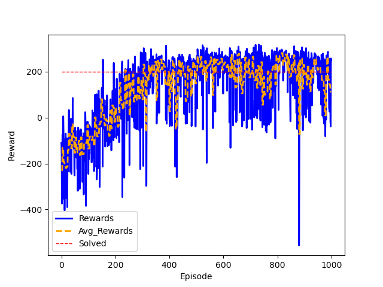

<div align="center">
    
# smart_cartpole-v1
<p></p>


This environment is one of the five [gymnasium's](https://gymnasium.farama.org/) [classic control](https://gymnasium.farama.org/environments/classic_control/) environments. The environment is stochastic in terms of its initial state, within a given range. A pole is attached by an un-actuated joint to a cart, which moves along a frictionless track. The pendulum is placed upright on the cart and the goal is to balance the pole by applying forces in the left and right direction on the cart.

***This is a pytorch implementation where we will solve this environmnet using two model, DeepQNetwork and Q learning.***

<!---

### Action Space

| Num | Action |
| :------: | :-----: |
| 0  | Push cart to the left |
| 1 | Push cart to the right  |

### Observation Space


| Num  | Observation Space |
| :-----: | :-----------: |
| 0  | Cart Position  |
| 1 | Cart Velocity |
| 2 | Pole Angle |
| 3 | Pole Angular Velocity |

### Rewards

Since the goal is to keep the pole upright for as long as possible, a reward of +1 for every step taken, including the termination step, is allotted. The threshold for rewards is 500 for v1 and 200 for v0.

### Episode End

The episode ends if any one of the following occurs:

Pole Angle is greater than ±12°. <br>
Cart Position is greater than ±2.4 (center of the cart reaches the edge of the display). <br>
Episode length is greater than 500 (200 for v0). <br>


--->

</div>


## Deep Q-Network (DQN) 


<div align="center">
    
| Hyperaparameters | Value |
| :-----------: | :----------: |
| `gamma` | 0.99  |
| `epsilon` | 1 |
| `epsilon_decay` | 0.995 |
| `epsilon_end` | 0.05 |
| `TAU` | 0.001 |
| `lr`<br> (learning rate)| 0.0001 |
| `replayBufferSize` | 10000 |
| `batchreplayBufferSize` | 128 |


<p>
  
  
  
  
  
  
  
  
</p>

</div>

## Q-Network
<div align="center">
    
| Hyperaparameters | Value |
| :-----------: | :----------: |
| `alpha` | 0.1  |
| `gamma` | 1 |
| `epsilon` | 0.2 |
| Discretized States | 30 |


<p>
    
    
    
    
    
    
    
    
</p>

</div>

## Libraries Used

* `gymnasium`
* `pytorch`
* `matplotlib`
* `pandas`
* `numpy`
* `moviepy`

## Setup
> [!Important]
> To install conda or miniconda follow this [link](https://conda.io/projects/conda/en/latest/user-guide/install/index.html)

If you have conda installed, Then to install all the supported libararies, just run,
```
git clone https://github.com/davnish/smart_cartpole-v1 # cloning the repo
cd smart_cartpole-v1 # Moving inside the repo
conda env create --name cartpole --file=conda_env.yml # Installing the libraries
```
Then just activate the environment by, 
```
conda activate cartpole
```
## Testing

For testing the models, go to inside the directory of the algortihm you want to test, then inside the `vis.py` run the function `Simulate_DQ_Strategy(<model_no>)` if testing DQN or `Simulate_Q_Strategy(<model_no>)` if testing Q, where `model_no` is the model number you want to test. Just run the function an environment will open simulating the learned strategy.

All the trained models are in there respective models direcotry. 

If you want the information of every model there is a `info.txt` which consist info of every trained model such as 
- `Episode` Number of episode trained on.
- `Time` Time taken by the model to train.
- `Ep Solved` Number of episode trained on and achieved >=200 rewards.
- `High_Score` Number of episode trained on and achieved >=300.
- `avg_intv` Average taken per Interval (shown in graphs above).

## Refrences
- https://aleksandarhaber.com/q-learning-in-python-with-tests-in-cart-pole-openai-gym-environment-reinforcement-learning-tutorial/
- https://pytorch.org/tutorials/intermediate/reinforcement_q_learning.html
